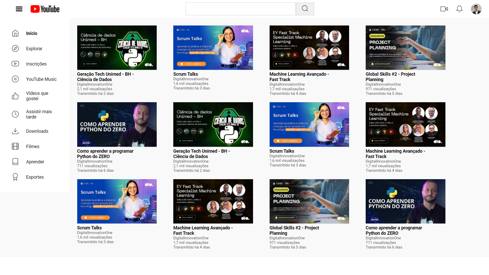

# DESAFIO-GRID

Este projeto é uma recriação da página inicial do **YouTube**, desenvolvida utilizando técnicas de **CSS Grid** e **Flexbox**. O objetivo foi replicar o layout da home page do YouTube, criando um design responsivo que se adapta a diferentes tamanhos de tela.

## Tecnologias Utilizadas

- **HTML5** para a estrutura.
- **CSS3** para estilização e layout responsivo.

## Preview

